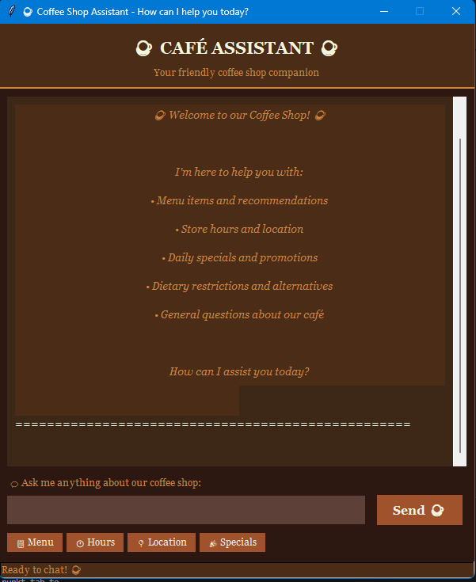
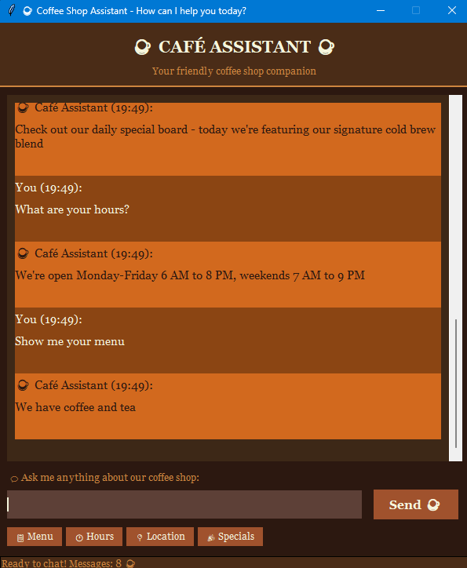

## Coffee Shop Chatbot (Tkinter + PyTorch)

A friendly and modern **Coffee Shop Chatbot** created with Python’s Tkinter GUI and a PyTorch-powered intent classifier. It provides quick answers about coffee shop menus, hours, locations, and more.

### Features

- Chatbot GUI styled for a café environment (custom colors, fonts, header)
- Smart chat responses using deep learning (intents from `intents.json`, PyTorch model)
- Supports greetings, menu queries, hours/location, payments, allergies, specials, jokes, feedback, and help
- Fast, responsive UI with quick action buttons and threading for smooth experience

***

### Setup

#### 1. Clone the project and navigate to the directory

```bash
git clone https://github.com/AvatarN03/Coffee-Chatbot.git
cd Coffee-Chatbot
```





#### 2. Install dependencies

Make sure Python 3.x is installed. Then install required packages:

```bash
pip install torch numpy nltk
```

Tkinter is included with standard Python installations.

#### 3. Download NLTK data

The first run will prompt NLTK to download required data:

```python
import nltk
nltk.download('punkt-tab')
```
(Make sure you have internet access.)

#### 4. Train the Chatbot (Optional)

To retrain the chatbot model (after changing intents):

```bash
python train.py
```

***

### Running the Application

```bash
python app.py
```

This will launch the **Coffee Shop Chat Assistant** GUI window.

***

### File Structure

| File            | Purpose                                        |
|-----------------|------------------------------------------------|
| app.py          | Main Tkinter GUI application                   |
| chat.py         | Bot logic, loads model & predicts intent       |
| model.py        | PyTorch model architecture                     |
| train.py        | Training script for the bot model              |
| intents.json    | Intents and response data                      |
| nltk_utils.py   | Tokenization and bag-of-words helpers          |
| data.pth        | Trained model weights (generated)              |

***

### Customization

- Edit `intents.json` for new questions and responses
- Rerun `train.py` if intents are changed
- Change colors/fonts in `app.py` for a different look


## References

- PyTorch/Tkinter chatbot examples
- Free Python desktop packaging
- NLTK, NumPy, PyTorch docs

